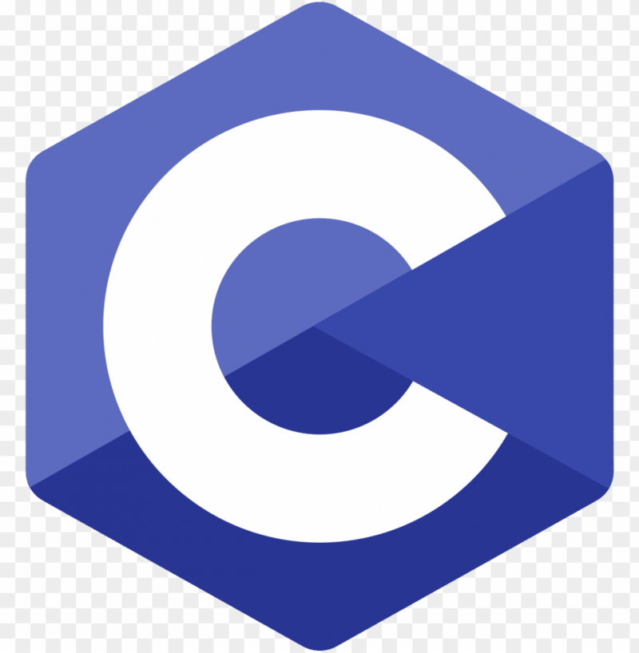

¡Hola! Soy Javier 👋

Estudiante de Ingeniería Informática apasionado por el mundo de la tecnología y la programación. Mi enfoque se centra en adquirir conocimientos sólidos y aplicarlos para resolver problemas complejos y crear soluciones innovadoras.

📚 Actualmente me encuentro cursando el segundo año de mi carrera en la Universidad de Córdoba. Mi búsqueda constante de aprendizaje me ha llevado a explorar gran variedad de temas, desde Data Science hasta Machine Learning.

💡 En mi tiempo libre, disfruto aprendiendo conceptos de Machine Learning y Deep Learning. Siempre estoy buscando nuevas oportunidades para aprender y desafiarme a mí mismo, y mi objetivo es aplicar estos conocimientos para construir soluciones prácticas y significativas.

🌐 Creo en la comunidad y la contribución. Me apasiona compartir mi conocimiento y aprender de otros desarrolladores talentosos.

¡Explora mis repositorios para obtener una visión más profunda de mis proyectos y enfoques! Si estás interesado en colaborar en proyectos emocionantes o simplemente quieres charlar sobre tecnología, estaré encantado de conectarte.

La aventura de la ingeniería informática es desafiante y emocionante, y estoy emocionado por cada paso en este viaje. 🌟

<h3 align="left">Languages and Tools:</h3>

  

  

  
  <!-- Agrega más imágenes siguiendo el mismo patrón -->

                     

<!---
javier-esp/javier-esp is a ✨ special ✨ repository because its `README.md` (this file) appears on your GitHub profile.
You can click the Preview link to take a look at your changes.
--->
